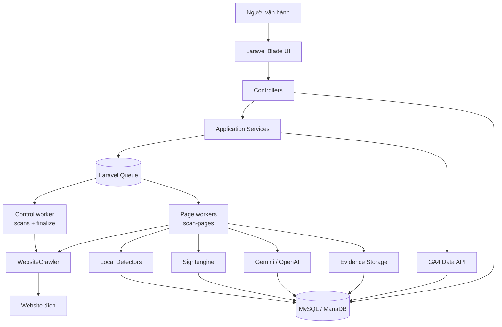
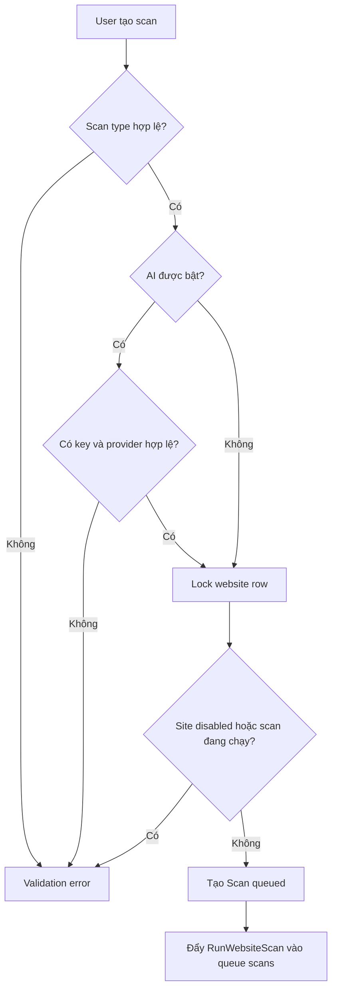
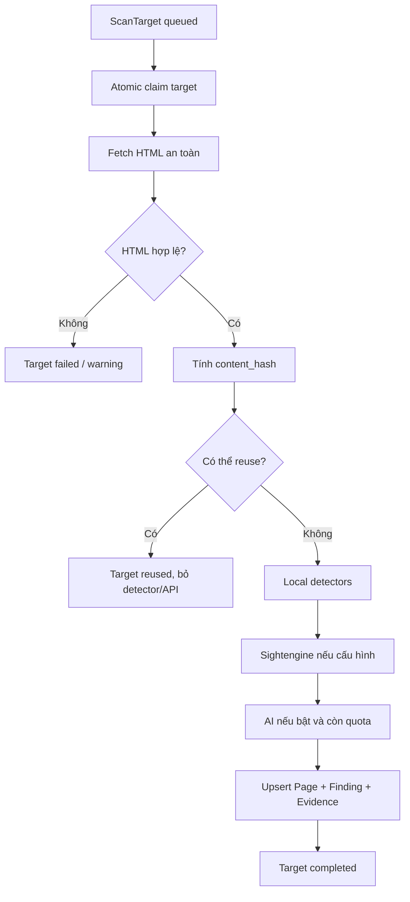
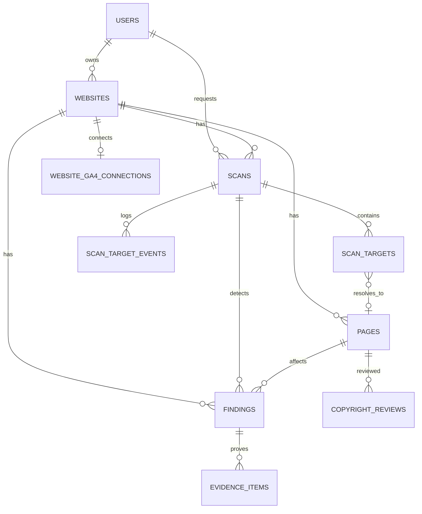
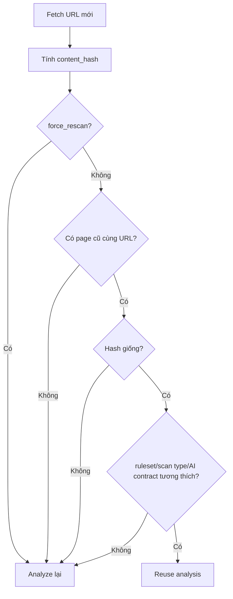
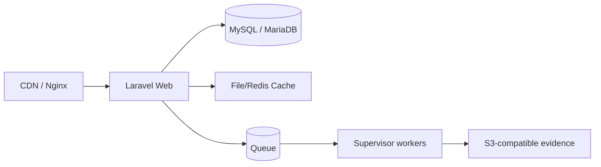

# MaxGuard - Tài liệu phân tích và thiết kế hệ thống

> Ngày lập: 2026-07-24  
> Nền tảng hiện tại: Laravel 10, PHP 8.1+, MySQL/MariaDB, Laravel Queue  
> Phạm vi tài liệu: phân tích nghiệp vụ, kiến trúc hệ thống, thiết kế dữ liệu, luồng xử lý, vận hành production và lộ trình phát triển.

---

## 1. Tóm tắt điều hành

MaxGuard là hệ thống kiểm tra rủi ro nội dung website, tập trung vào các vấn đề ảnh hưởng đến kiếm tiền quảng cáo như chất lượng nội dung, duplicate content, copyright signals, privacy/consent, ad experience và các nội dung nhạy cảm. Đầu vào là một domain hoặc URL website. Đầu ra là điểm rủi ro của website, danh sách URL có vấn đề, finding theo mức độ nghiêm trọng, evidence và hướng xử lý.

Thiết kế hiện tại đi đúng hướng cho một sản phẩm compliance monitoring:

- Crawl website theo sitemap, robots.txt và internal links.
- Chạy detector local trước để tiết kiệm chi phí và có kết quả ổn định.
- Gọi Sightengine/AI như lớp đánh giá bổ sung, không để external API quyết định toàn bộ.
- Dùng GA4 để ưu tiên quét các URL có traffic cao.
- Chạy queue song song theo batch URL để scan lớn không bị nghẽn ở một worker.
- Có incremental scan dựa trên content hash và analysis contract để tránh phân tích lại nội dung không đổi.
- Lưu finding/evidence/telemetry để debug và audit.

Điểm cần hoàn thiện trước khi đưa thành SaaS hoặc vận hành cho nhiều khách hàng là multi-tenant workspace, audit log, Redis queue/cache, alerting, retention policy cho evidence, renderer bằng Playwright, và quy trình human review rõ ràng cho copyright.

---

## 2. Mục tiêu nghiệp vụ

### Bài toán cần giải quyết

Người vận hành cần biết website nào có rủi ro chính sách, URL nào đang vi phạm hoặc cần kiểm tra, mức độ nghiêm trọng ra sao và nên sửa theo thứ tự nào. Với site nhiều bài viết, hệ thống phải ưu tiên bài có traffic cao hoặc bài mới, tránh quét lại lãng phí và vẫn có đủ bằng chứng để review.

### Kết quả mong muốn

| Đầu vào | Xử lý | Đầu ra |
|---|---|---|
| Domain/start URL | Crawl sitemap, robots, internal links | Danh sách URL crawlable |
| Nội dung HTML | Local detectors, duplicate, privacy, ad experience | Finding deterministic |
| Nội dung text | Sightengine/AI tùy cấu hình | Finding semantic |
| GA4 property | Lấy page views 7 ngày | Ưu tiên URL có traffic |
| Finding | Evidence, remediation, workflow | Báo cáo audit và export |

### Phạm vi không nên tự động hóa tuyệt đối

- Không tự động kết luận chắc chắn "vi phạm bản quyền" chỉ từ similarity.
- Không xem AI là nguồn quyết định cuối cùng.
- Không retry vô hạn các lỗi quota/HTTP 400/403/429.
- Không scan private IP, link-local IP hoặc nội dung phía sau login.

---

## 3. Yêu cầu hệ thống

### Functional requirements

| Nhóm | Yêu cầu |
|---|---|
| Website management | Thêm site, xem trạng thái, điểm rủi ro, lịch sử scan |
| URL discovery | Đọc robots.txt, sitemap index, sitemap con, internal links |
| Scan modes | Full, priority, copyright, ads, privacy, newest posts sample |
| Local analysis | Chạy detector chất lượng, duplicate, copyright signals, ads, privacy, technical trust |
| AI analysis | Gọi Gemini/OpenAI khi bật AI và còn quota |
| Third party moderation | Gọi Sightengine text moderation khi cấu hình |
| GA4 priority | OAuth read-only, sync pagePath/page views 7 ngày |
| Incremental scan | Bỏ qua analysis nếu content hash và ruleset contract không đổi |
| Findings | Severity, confidence, status workflow, remediation |
| Evidence | Snapshot/private evidence, SHA-256 integrity |
| Observability | Timeline từng URL, stage, duration, HTTP status, request id |
| Export | CSV/XLSX findings và website report |

### Non-functional requirements

| Nhóm | Yêu cầu thiết kế |
|---|---|
| Scale | Scan được hàng trăm đến hàng nghìn URL bằng queue batch song song |
| Cost control | Local-first, AI page cap, incremental reuse, circuit breaker |
| Reliability | Idempotent jobs, atomic claim token, retry có backoff |
| Security | Chống SSRF, auth, ownership check, encrypted OAuth token |
| Auditability | Lưu ruleset version, evidence hash, timeline stage |
| Operability | Có queue doctor, recover stuck scans, supervisor config |
| Extensibility | Detector contract, external analyzer adapter, scan type filter |

---

## 4. Kiến trúc tổng thể đề xuất



### Nguyên tắc kiến trúc

1. Laravel web/API chỉ điều phối, xác thực, hiển thị và ghi dữ liệu.
2. Crawl, detector, AI và evidence chạy trong queue worker, không chạy trong request web.
3. Local detector luôn hoạt động độc lập, external API lỗi không làm chết toàn scan.
4. Mỗi URL là một `ScanTarget`, có trạng thái và timeline riêng.
5. Finalizer chỉ chốt scan khi mọi target đã hoàn tất hoặc fail rõ ràng.
6. Mọi thay đổi detector lớn cần tăng `ruleset_version` để tránh reuse sai.

---

## 5. Thiết kế module

| Module | Thành phần chính | Trách nhiệm |
|---|---|---|
| Auth & tenant | Auth routes, middleware, ownership checks | Đăng nhập, giới hạn dữ liệu theo user/site |
| Website | `SiteController`, `Website` | Quản lý domain, trạng thái, score |
| Scan orchestration | `ScanController`, `ScanDispatcher`, `ScanRunner` | Tạo scan, dispatch queue, điều phối batch |
| Crawling | `WebsiteCrawler`, `SafeHttpClient` | Robots, sitemap, redirect-safe fetch, SSRF protection |
| URL target | `ScanTarget`, `RunScanPageBatch` | Chia URL thành batch, claim và xử lý song song |
| Detector local | `DetectorRegistry`, detector classes | Phát hiện risk deterministic |
| External analyzer | `SightengineTextAnalyzer`, `AiPolicyAnalyzer` | Chuẩn hóa kết quả external thành `DetectorResult` |
| GA4 | `Ga4Controller`, `Ga4TrafficService` | OAuth, refresh token, sync traffic |
| Findings | `FindingController`, `RiskScoreCalculator` | Upsert finding, workflow, score |
| Evidence | `EvidenceStore`, `EvidenceItem` | Snapshot, hash, private storage |
| Telemetry | `ScanTelemetry`, `ScanTargetEvent` | Timeline stage, debug từng URL |
| Export | CSV/XLSX export | Xuất báo cáo cho vận hành/khách hàng |

---

## 6. Luồng xử lý chính

### 6.1. Tạo scan



### 6.2. Discovery URL

Thứ tự discovery nên giữ như hiện tại:

1. Chuẩn hóa `start_url`.
2. Đọc `robots.txt` và sitemap được khai báo.
3. Thử các endpoint sitemap phổ biến như `/sitemap.xml`, `/sitemap_index.xml`, `/wp-sitemap.xml`.
4. Phân biệt `sitemapindex` và `urlset`, đọc sitemap con đệ quy.
5. Nếu có `Maximum newest posts`, ưu tiên `post-sitemap*.xml`, sort theo `<lastmod>` giảm dần và chọn đúng N URL.
6. Nếu không có sitemap, dùng start URL và mở rộng internal links trong giới hạn.
7. Loại URL ngoài host, scheme không hợp lệ, private IP, robots blocked hoặc duplicate hash.

### 6.3. Xử lý một URL



### 6.4. Finalize scan

Finalizer có ba việc:

1. Chờ cho đến khi không còn target `queued/running`.
2. Chạy duplicate comparison toàn sample và resolve finding cũ theo điều kiện an toàn.
3. Tính `risk_score`, cập nhật `scan.status` và `website.status`.

Scan nên là `completed` khi coverage đủ; là `partial` khi có target lỗi, sitemap bị cắt ngoài ý muốn, robots block hoặc selected URL failure.

---

## 7. Thiết kế queue và concurrency

Từ bản 1.2.0, thiết kế queue đã được tách đúng theo workload:

| Queue | Job | Vai trò | Worker khuyến nghị |
|---|---|---|---|
| `scans` | `RunWebsiteScan` | Discovery và tạo `scan_targets` | 1 control worker |
| `scan-pages` | `RunScanPageBatch` | Crawl/analyze từng batch URL | 6 page workers |
| `scan-finalize` | `FinalizeWebsiteScan` | Chốt duplicate, resolve, score | dùng chung control worker |

Với 300 URL và `MAXGUARD_PAGE_BATCH_SIZE=10`, hệ thống tạo khoảng 30 page jobs. Sáu page workers có thể xử lý sáu batch đồng thời, nhưng global host limiter vẫn giữ tốc độ tổng theo `MAXGUARD_HOST_RPS`, tránh bắn quá nhanh vào website đích.

### Cấu hình production đề xuất

```dotenv
QUEUE_CONNECTION=database
DB_QUEUE_RETRY_AFTER=2400

MAXGUARD_QUEUE=scans
MAXGUARD_PAGE_QUEUE=scan-pages
MAXGUARD_FINALIZE_QUEUE=scan-finalize
MAXGUARD_PAGE_BATCH_SIZE=10
MAXGUARD_PAGE_WORKERS=6
MAXGUARD_ORCHESTRATOR_TIMEOUT=900
MAXGUARD_PAGE_JOB_TIMEOUT=1800
MAXGUARD_FINALIZE_TIMEOUT=900
MAXGUARD_HOST_RPS=1.5
```

Nếu chạy nhiều server hoặc cần scale ổn định, nên chuyển queue/cache sang Redis để distributed lock, circuit breaker và rate limiter dùng chung.

---

## 8. Thiết kế dữ liệu



### Bảng cốt lõi

| Bảng | Mục đích | Trường đáng chú ý |
|---|---|---|
| `websites` | Một domain/site của user | `domain`, `start_url`, `status`, `overall_score`, `last_scanned_at`, `settings` |
| `scans` | Một lần quét | `type`, `status`, `progress`, `max_urls`, `use_ai`, `force_rescan`, `ruleset_version` |
| `scan_targets` | Một URL trong scan | `url`, `status`, `claim_token`, `analysis_reused`, `attempts` |
| `scan_target_events` | Timeline debug | `stage`, `status`, `duration_ms`, `service`, `http_status`, `context` |
| `pages` | Nội dung mới nhất của URL | `url_hash`, `content_hash`, `title`, `language`, `ga4_views_7d`, `meta` |
| `findings` | Issue/risk | `rule_key`, `category`, `severity`, `confidence`, `status`, `fingerprint` |
| `evidence_items` | Bằng chứng | `finding_id`, `type`, `path`, `sha256`, `metadata` |
| `website_ga4_connections` | Kết nối GA4 | `property_id`, encrypted token, expiry |
| `copyright_reviews` | Review thủ công | `matched_url`, `status`, `notes`, `reviewed_by` |

### Nguyên tắc dữ liệu quan trọng

- `findings.fingerprint = sha256(rule_key | lower(url) | fingerprint_salt)` để cùng một lỗi trên cùng URL không tạo trùng vô hạn.
- `pages.content_hash` là SHA-256 của text đã normalize, dùng cho incremental scan.
- `pages.meta.maxguard_analysis` lưu marker gồm ruleset, scan type, AI coverage và model.
- `evidence_items` nên immutable; scan mới tạo evidence version mới thay vì sửa file cũ.
- Token GA4 phải dùng encrypted cast và không ghi vào log/telemetry.

---

## 9. Thiết kế detector và AI

### Local detector contract

Detector nên đi theo contract đơn giản:

```php
interface Detector
{
    public function key(): string;
    public function detect(PageDocument $page): array;
}
```

Mỗi detector trả về danh sách `DetectorResult`. Registry chịu trách nhiệm lọc detector theo scan type và merge kết quả.

### Detector hiện có

| Detector | Rủi ro phát hiện |
|---|---|
| `ContentQualityDetector` | Thin content, low-value content |
| `DuplicateContentDetector` | Duplicate/similarity nội bộ |
| `CopyrightSignalsDetector` | Dấu hiệu copy/copyright cần review |
| `AdExperienceDetector` | Mật độ quảng cáo, trải nghiệm ads |
| `AdsTxtDetector` | ads.txt/site signal |
| `PrivacyDetector` | Privacy, disclosure, consent |
| `TechnicalTrustDetector` | Trust/technical signals |

### AI policy analyzer

AI chỉ nên là semantic review sau local detector. Guardrail cần giữ:

- Chỉ chạy khi `scan.use_ai=true` và server có key.
- Giới hạn số page bằng `MAXGUARD_AI_MAX_PAGES_PER_SCAN`.
- Truncate input bằng `MAXGUARD_AI_MAX_INPUT_CHARS`.
- Prompt coi page content là untrusted data.
- Structured output, chỉ nhận policy code trong danh sách cố định.
- Finding dưới `MAXGUARD_AI_MIN_CONFIDENCE` bị loại.
- Lỗi AI/quota không làm hỏng deterministic scan.
- AI finding cũ chỉ resolve khi URL đó đã được AI phân tích lại thành công.

### Sightengine

Sightengine là lớp moderation bổ sung cho text. Nên dùng circuit breaker:

- Daily usage limit: mở circuit đến cuối ngày.
- HTTP/quota error: ghi telemetry sanitized, không spam retry.
- Score `>= 0.85`: high.
- Score từ threshold đến `< 0.85`: review.
- Dưới threshold: bỏ qua.

---

## 10. Incremental scan

Incremental scan là điểm rất quan trọng vì hệ thống compliance có thể chạy lặp lại nhiều lần.



Khi reuse:

- Không gọi detector, Sightengine, AI.
- Không tạo snapshot/evidence mới.
- Cập nhật crawl metadata và `last_scan_id`.
- Warm fingerprint để finalize vẫn so sánh duplicate được.
- Không đưa page reused vào tập auto-resolve để tránh resolve nhầm.

---

## 11. Thiết kế màn hình vận hành

| Màn hình | Mục tiêu | Thành phần chính |
|---|---|---|
| Dashboard | Nhìn nhanh site nào rủi ro | Tổng site, critical/high/review, scan gần nhất, queue health |
| Sites | Quản lý website | Domain, status, score, open findings, last scan |
| Site detail | Xem sức khỏe từng site | Trend score, findings theo category, GA4 connection, recent scans |
| Scan Center | Tạo và theo dõi scan | Scan type, newest posts limit, AI toggle, force rescan, live progress |
| Scan detail | Debug từng lần scan | Targets, status, stage, current URL, failed/reused/completed |
| Target detail | Debug một URL | Timeline crawl/local/Sightengine/AI, HTTP status, duration, message |
| Findings | Ưu tiên xử lý lỗi | Filter severity/category/status/site, bulk export |
| Finding detail | Review và xử lý | Evidence, summary, remediation, workflow, copyright review |
| Integrations | Kết nối dịch vụ | GA4 OAuth, property ID, API status/quota |
| Settings | Cấu hình hệ thống | Threshold, scan schedule, detector toggles, retention |

Dashboard nên ưu tiên câu hỏi vận hành: "Website nào đang nguy hiểm nhất?", "URL nào cần sửa trước?", "Scan nào bị kẹt?", "Quota/API nào đang lỗi?".

---

## 12. Bảo mật

### Đã có hoặc cần giữ

- Route middleware `auth`.
- Ownership check theo `website.user_id`.
- Google OAuth state validation.
- GA4 token mã hóa bằng Eloquent encrypted cast.
- SSRF protection: chỉ HTTP/HTTPS, public IP, validate lại sau redirect.
- Response byte limit, connect timeout, request timeout.
- Per-host rate limiter.
- Không lưu secret/full page content vào telemetry.
- Evidence có SHA-256.

### Cần bổ sung trước production/SaaS

| Hạng mục | Lý do |
|---|---|
| Workspace/membership | Nhiều khách hàng, nhiều user trong một team |
| Laravel Policies đầy đủ | Không chỉ check ID trong controller |
| Audit log | Theo dõi ai resolve/suppress/export/delete |
| Signed evidence URL | Evidence private, link ngắn hạn |
| Secret rotation | Key từng lộ qua log/chat phải rotate |
| Storage/log protection | Không public `storage/`, không commit `.env` |
| Backup/restore drill | Tránh mất DB và evidence |

---

## 13. Observability và troubleshooting

### Telemetry theo URL

Mỗi `ScanTarget` nên có timeline:

```text
crawl -> local_rules -> sightengine -> gemini -> finished
```

Hoặc nếu không đổi:

```text
crawl -> reuse
```

Trường nên lưu: `stage`, `status`, `duration_ms`, `service`, `http_status`, `request_id`, `message`, `context`.

Không lưu: API key, secret, OAuth token, Authorization header, full text/content.

### Health checks vận hành

```bash
php artisan maxguard:queue-doctor
php artisan queue:failed
php artisan migrate:status
```

Các chỉ số cần cảnh báo:

- Scan running quá lâu.
- `scan_targets.running` quá timeout.
- `jobs` tăng nhưng không giảm.
- Tỷ lệ target failed cao.
- API 429/quota tăng.
- Circuit breaker mở lâu.
- Evidence/log disk gần đầy.

---

## 14. Triển khai production

### Mô hình tối thiểu



### Supervisor workers

- 1 control worker cho `scans,scan-finalize`.
- 6 page workers cho `scan-pages`.
- `retry_after` phải lớn hơn timeout job dài nhất.
- Sau deploy phải `queue:restart` để worker load code mới.

### Quy trình deploy

1. Build release cố định, không sửa code trực tiếp trên server.
2. Nginx document root trỏ vào `/public`.
3. Chạy migration bằng release job riêng.
4. `php artisan optimize` sau khi `.env` đúng.
5. Restart queue worker bằng `php artisan queue:restart`.
6. Kiểm tra `maxguard:queue-doctor`, HTTP app, DB, cache, evidence storage.

---

## 15. Rủi ro thiết kế và cách giảm thiểu

| Rủi ro | Tác động | Giảm thiểu |
|---|---|---|
| Scan quá lớn làm nghẽn queue | Chậm toàn hệ thống | Batch target, page workers riêng, host rate limit |
| Retry làm gọi AI trùng | Tốn chi phí, duplicate finding | Reserve AI slot atomically, idempotent job |
| Reuse sai sau khi đổi detector | Bỏ sót lỗi | Tăng `ruleset_version` khi logic thay đổi |
| External API quota hết | Missing semantic findings | Circuit breaker, telemetry, local scan vẫn chạy |
| Crawler đụng private network | SSRF/security incident | Public IP validation, redirect validation |
| Copyright false positive | Quyết định sai nghiệp vụ | Human review, evidence rõ, không kết luận tự động |
| Evidence lộ public | Rò rỉ nội dung khách hàng | Private storage, signed URL, audit download |
| Multi-tenant thiếu scope | Lộ dữ liệu giữa khách hàng | Workspace model, policies, tenant scope |

---

## 16. Lộ trình phát triển

### Phase 1 - Ổn định MVP production

- Cấu hình Supervisor chính thức.
- Dùng Redis cho queue/cache nếu tải lớn.
- Đăng ký scheduler `maxguard:scan-due-sites`.
- Thêm alert queue lag, scan failure ratio, API quota.
- Hoàn thiện test full pipeline batch/finalize.
- Chuẩn hóa export báo cáo cho khách hàng.

### Phase 2 - Nâng độ chính xác compliance

- Playwright renderer để chụp screenshot mobile/desktop.
- Kiểm tra ad placement thực tế, sticky/anchor/CMP theo region.
- External duplicate/copyright similarity index.
- Media provenance: perceptual hash, EXIF, license, attribution.
- Rule editor cho warning phrases và site-specific policy.

### Phase 3 - SaaS/multi-tenant

- Workspace, member, role và billing limits.
- Audit log đầy đủ.
- Notification qua email/webhook/Slack khi critical finding.
- Quota dashboard cho AI/Sightengine.
- Retention policy và export package có signed evidence.
- GA4 property picker thay vì nhập property ID thủ công.

---

## 17. Checklist nghiệm thu

### Chức năng

- [ ] Thêm website và tạo full scan thành công.
- [ ] Scan newest posts đúng N bài mới nhất từ `post-sitemap*.xml`.
- [ ] Priority scan dùng GA4 page views 7 ngày để sắp xếp URL.
- [ ] Finding xuất hiện live trước khi scan hoàn tất.
- [ ] Incremental scan bỏ qua URL không đổi.
- [ ] Force rescan phân tích lại toàn bộ URL.
- [ ] Copyright review lưu được matched URL và notes.
- [ ] Export XLSX/CSV mở được và đúng dữ liệu.

### Queue

- [ ] `maxguard:queue-doctor` liệt kê đủ `scans`, `scan-pages`, `scan-finalize`.
- [ ] Một control worker đang chạy.
- [ ] N page workers đang chạy.
- [ ] `retry_after` lớn hơn job timeout.
- [ ] `queue:restart` sau deploy và Supervisor tự restart process.

### Security

- [ ] HTTPS bật.
- [ ] `.env` không nằm trong Git.
- [ ] API key đã rotate nếu từng lộ.
- [ ] OAuth token giải mã được.
- [ ] Evidence storage private.
- [ ] Ownership test đạt.
- [ ] Không có secret/full content trong log.

### Quan sát

- [ ] Scan detail hiển thị target completed/reused/failed.
- [ ] Target detail hiển thị timeline từng stage.
- [ ] API 429/quota có telemetry và circuit breaker.
- [ ] Có cảnh báo scan kẹt hoặc failed ratio cao.

---

## 18. Kết luận thiết kế

MaxGuard nên được xem là một pipeline compliance bất đồng bộ theo URL, không phải một crawler chạy đồng bộ trong request web. Các thực thể trung tâm là:

- `Website`: site cần giám sát.
- `Scan`: một lần quét.
- `ScanTarget`: một URL trong scan.
- `Page`: trạng thái nội dung mới nhất của URL.
- `Finding`: issue/risk có fingerprint ổn định.
- `EvidenceItem`: bằng chứng bất biến.
- `ScanTargetEvent`: dữ liệu debug và audit theo stage.

Thiết kế hiện tại đã có nền tốt để triển khai thực tế. Việc nên ưu tiên tiếp theo là hardening vận hành, multi-tenant, alerting và nâng cấp evidence bằng browser rendering. Phần AI nên tiếp tục giữ vai trò hỗ trợ đánh giá ngữ nghĩa, còn quyết định cuối cùng về copyright/policy nhạy cảm cần có evidence và human review.
